# **BLOC GUI Miner**

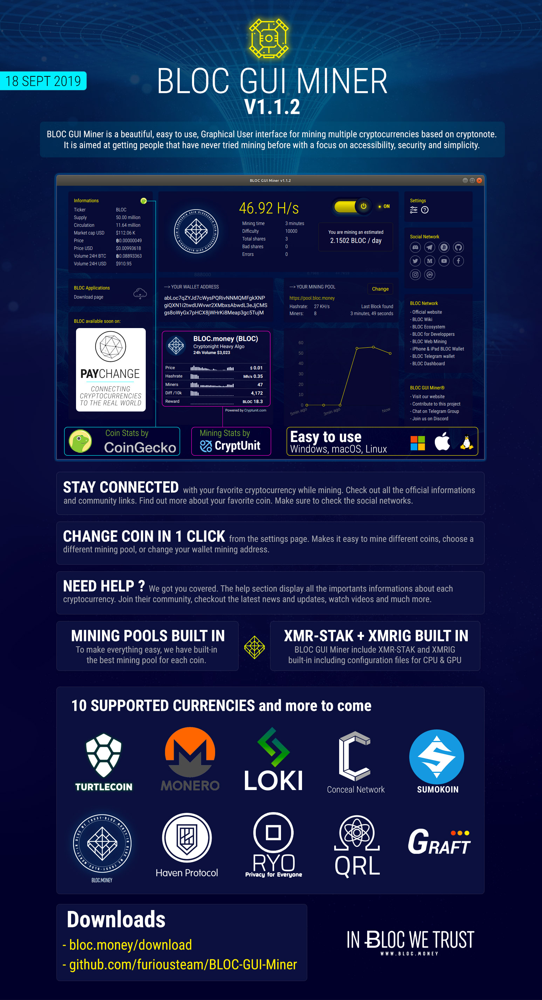

[BLOC GUI Miner](https://github.com/furiousteam/BLOC-GUI-Miner) is a beautiful, easy to use, Graphical User interface for mining multiple cryptocurrencies based on cryptonote. The BLOC GUI Miner is easy to use and makes you getting started with mining cryptocurrency on Windows, MacOS and Linux in no time.

It is aimed at getting people that have never tried mining before with a focus on accessibility, security and simplicity.

BLOC GUI Miner support two very popular miner backends: [xmr-stak](https://github.com/fireice-uk/xmr-stak) and [xmrig](https://github.com/xmrig/xmrig)

BLOC GUI Miner comes with **XMR-STAK 2.10.7** and XMRIG **3.1.2** already built-in, including configuration files for CPU and GPU mining in most of the cases.

If you want to learn about cryptocurrencies, [mining](https://wiki.bloc.money/mining/what-is-mining/) is a great place to start!

[Start mining](https://wiki.bloc.money/mining/bloc-gui-miner-using/#start-mining) today and get rewarded in your favorite cryptocurrency.

## **Previous Updates**

[Previous Updates](DOCS/updates)

## What's New in v1.1.2 ?

- 💎 Built-in latest XMR-STAK & XMRIG
- ✅ Now support $BLOC $TRTL $XMR $RYO $XHV $SUMO $LOKI $QRL $CCX $GRFT
- 🖥 Works on macOS, Windows (7, 8, 10) & Linux x64
- 🎖 Best Mining Pools built-in
- ❇️ Change mining pool or coin in 1 click
- ℹ️ Complete informations about each currency with links
- 🔸 Easy to use
- 📈 Price & Coin Stats by CoinGecko
- 📊 Mining Stats by Cryptunit
- ♻️ CPU & GPU Mining

Online Support:

- [Discord](https://discord.gg/5Buudya)
- [Telegram](https://t.me/bloc_money)

## **Screenshots**

*Home*

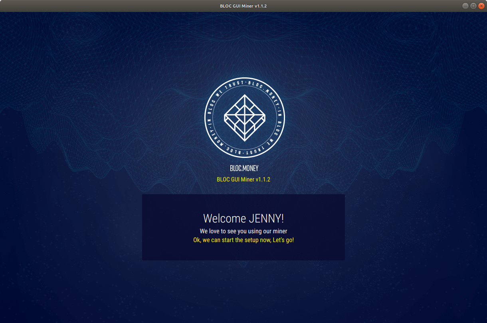

*Miner Setup*

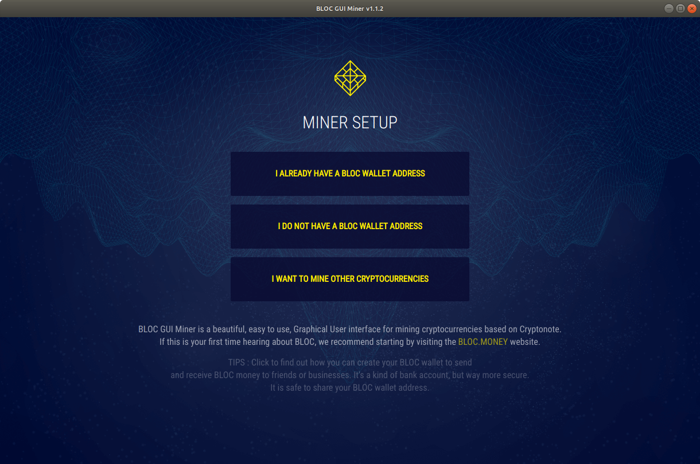

*Select Coin to Mine*

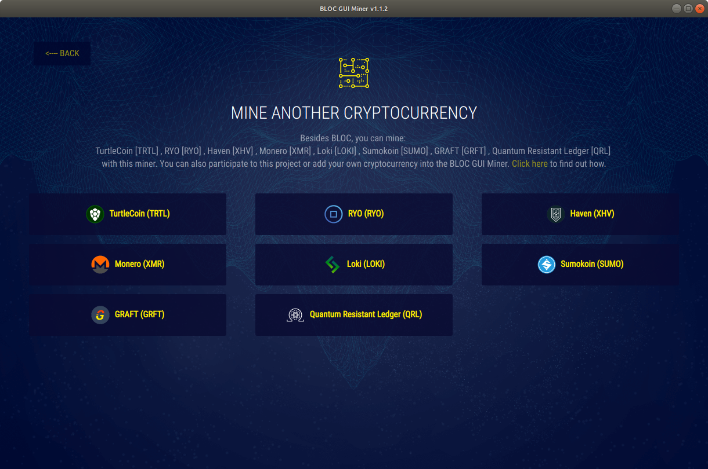

*Select Mining Pool*

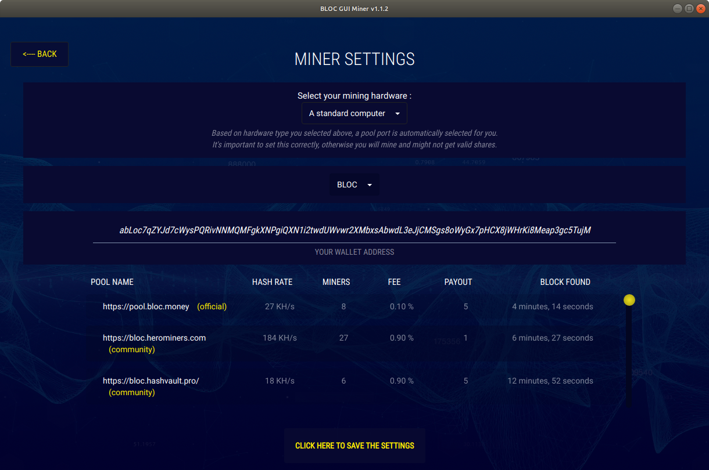

*Help*

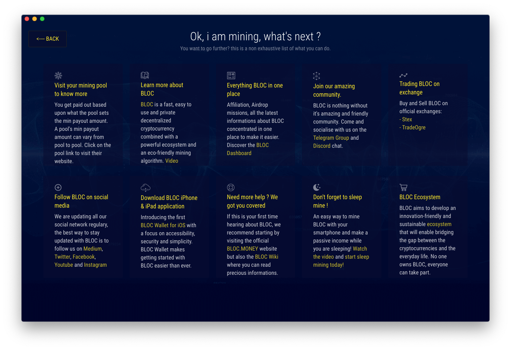

## **Supported Cryptocurrencies**

Everyone can add their own cryptocurrency to the BLOC GUI Miner as long as it is supported by **XMR-STAK** and **XMRIG**. In the same time everyone can add/edit a mining pool into the BLOC GUI Miner.

You can mine the following cryptocurrencies with the BLOC GUI Miner :

- [BLOC.MONEY](https://bloc.money) **(BLOC)**
- [TurtleCoin](https://turtlecoin.lol) **(TRTL)**
- [RYO](https://ryo-currency.com) **(RYO)**
- [Haven](https://www.havenprotocol.com) **(XHV)**
- [Monero](https://www.getmonero.org) **(XMR)**
- [Loki](https://loki.network) **(LOKI)**
- [Sumokoin](https://www.sumokoin.org) **(SUMO)**
- [GRAFT](https://www.graft.network) **(GRFT)**
- [Conceal Network](https://conceal.network) **(CCX)**
- [Quantum Resistant Ledger](https://www.theqrl.org) **(QRL)**

If you would like to contribute to this project by adding or editing a mining pool but also to add a new cryptonote currency please checkout the [instructions available](https://github.com/furiousteam/BLOC-GUI-Miner/tree/master/coins).

### **BLOC.MONEY (BLOC) mining**

[BLOC.MONEY](https://bloc.money) is a fast, easy to use and private decentralized cryptocurrency. Send money spacewide, worldwide or locally, immediately and without costly intermediaries using the blockchain technology.

*Mining BLOC:*

[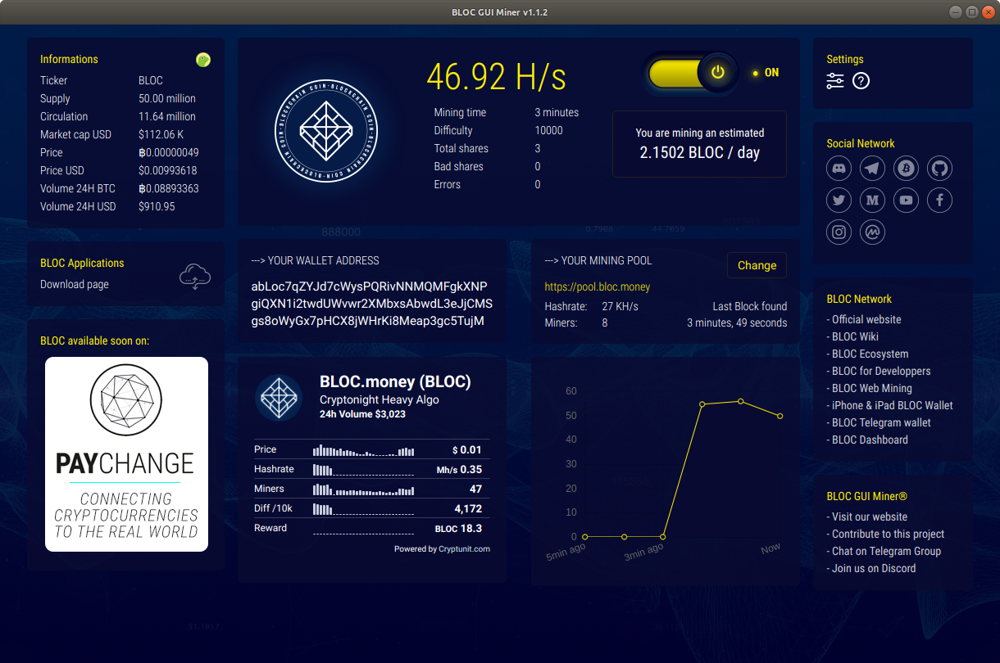](https://wiki.bloc.money/mining/bloc-gui-miner-using/)

### **TurtleCoin (TRTL) Mining**

[TurtleCoin](https://github.com/turtlecoin/turtlecoin) is a fast, easy and private cryptocurrency which allows you to send money to friends and businesses.
*Note*: Mining TurtleCoin only works with XMRIG and support the new Chukwa algorithm.

*Mining TRTL:*

[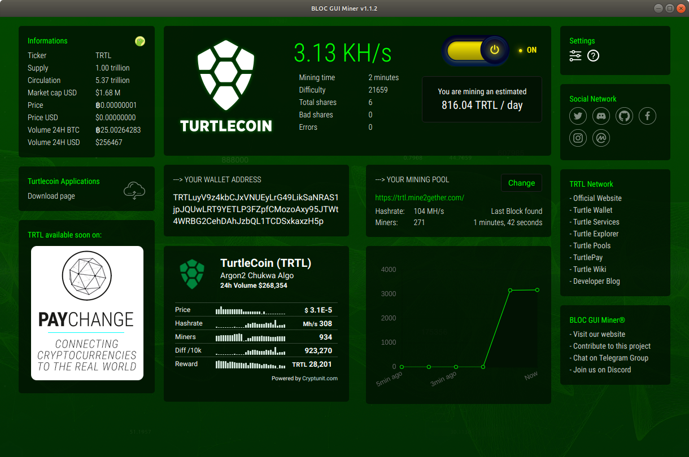](https://wiki.bloc.money/mining/bloc-gui-miner-using/#mining-turtlecoin-trtl)

### **Haven (XHV) Mining**

[Haven](https://www.havenprotocol.com) protocol is a fully decentralized, private, algorithmic stablecoin that can be stored in a Haven wallet which can be seen as a private and decentralized USD-based bank account for everyone.

*Mining XHV:*

[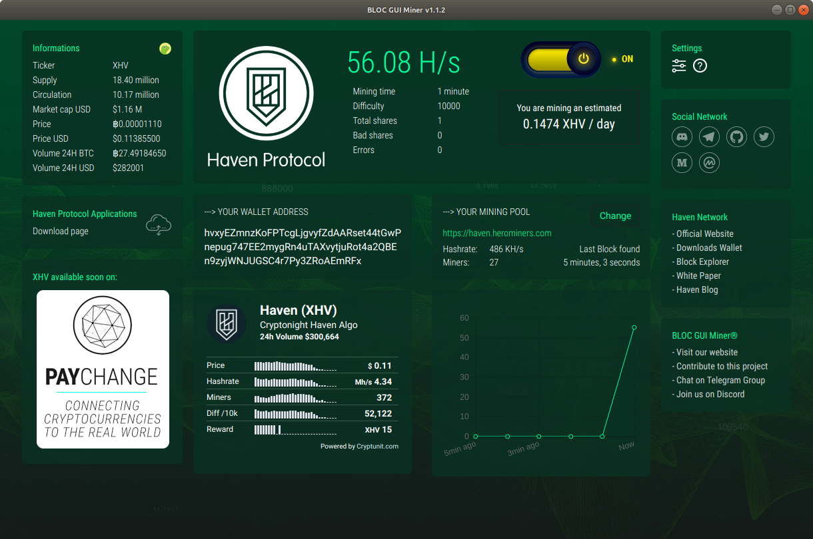](https://wiki.bloc.money/mining/bloc-gui-miner-using/#mining-haven-xhv)

### **Monero (XMR) Mining**

[Monero](https://www.getmonero.org) Monero is cash for a connected world. It’s fast, private, and secure. With Monero, you are your own bank. You can spend safely, knowing that others cannot see your balances or track your activity.

*Mining XMR:*

[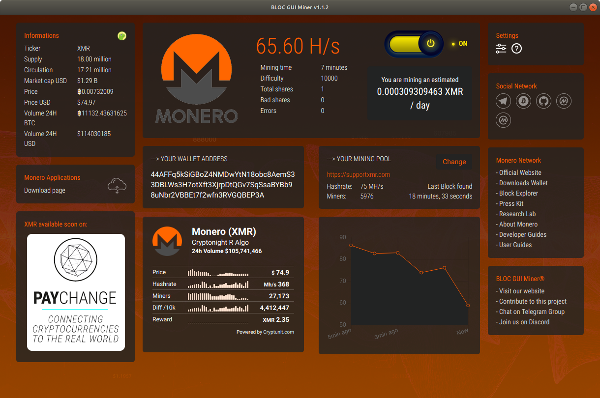](https://wiki.bloc.money/mining/bloc-gui-miner-using/#mining-monero-xmr)

### **RYO (RYO) Mining**

[RYO](https://ryo-currency.com) RYO Currency confidently transact with the highest degree of anonymity.

*Mining RYO:*

[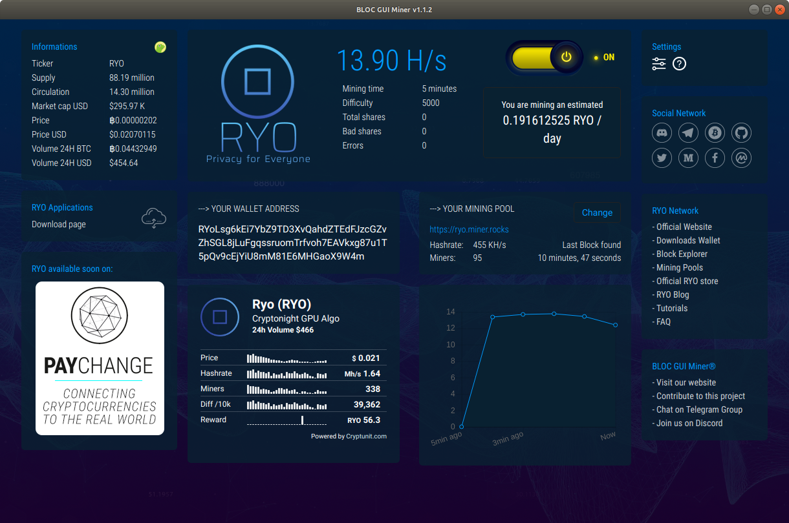](https://wiki.bloc.money/mining/bloc-gui-miner-using/#mining-RYO-ryo)

### **LOKI (LOKI) Mining**

[Loki](https://loki.network) Loki is a privacy network which will allow users to transact and communicate privately over the internet, providing a suite of tools to help maintain the maximum amount of anonymity possible while browsing, transacting and communicating online..

*Mining LOKI:*

[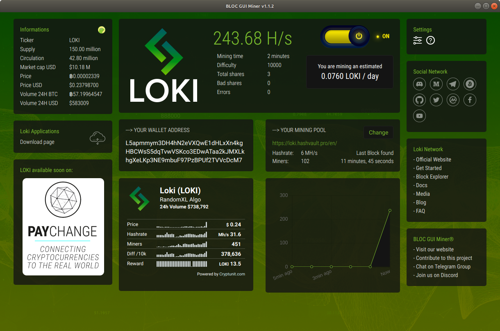](https://wiki.bloc.money/mining/bloc-gui-miner-using/#mining-loki-loki)

### **SUMOKOIN (SUMO) Mining**

[Sumokoin](https://www.sumokoin.org) DIGITAL CASH - Privacy Without Compromise. Private • Untraceable • Decentralized • Fungible

*Mining SUMO:*

[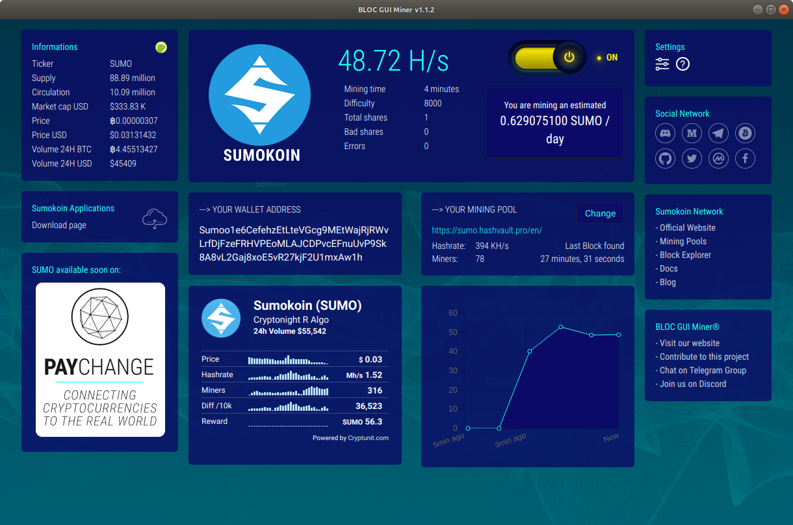](https://wiki.bloc.money/mining/bloc-gui-miner-using/#mining-sumokoin-sumo)

### **GRAFT (GRFT) Mining**

[GRAFT](https://www.graft.network) GRAFT is a combination (PoW, PoS, DAG) blockchain and a platform that enables a truly decentralized payment network with real-time, universal payment acceptance.

*Mining GRFT:*

[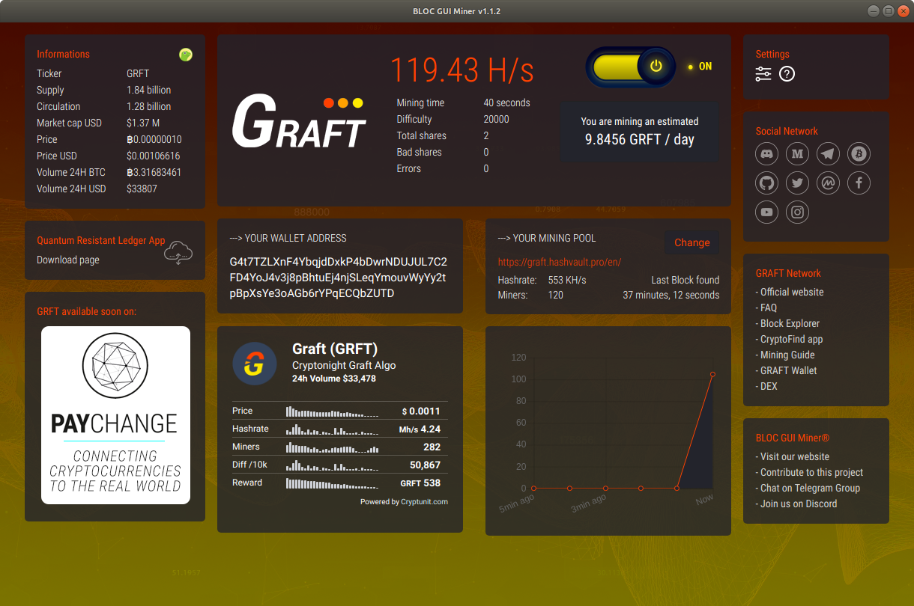](https://wiki.bloc.money/mining/bloc-gui-miner-using/#mining-graft-grft)

### **CONCEAL NETWORK (CCX) Mining**

[Conceal Network](https://conceal.network) Conceal.Network is a decentralized blockchain bank, with deposits and investments paying interest rates, without involvement of financial institutions, powered by 100% open source code.

*Mining CCX:*

[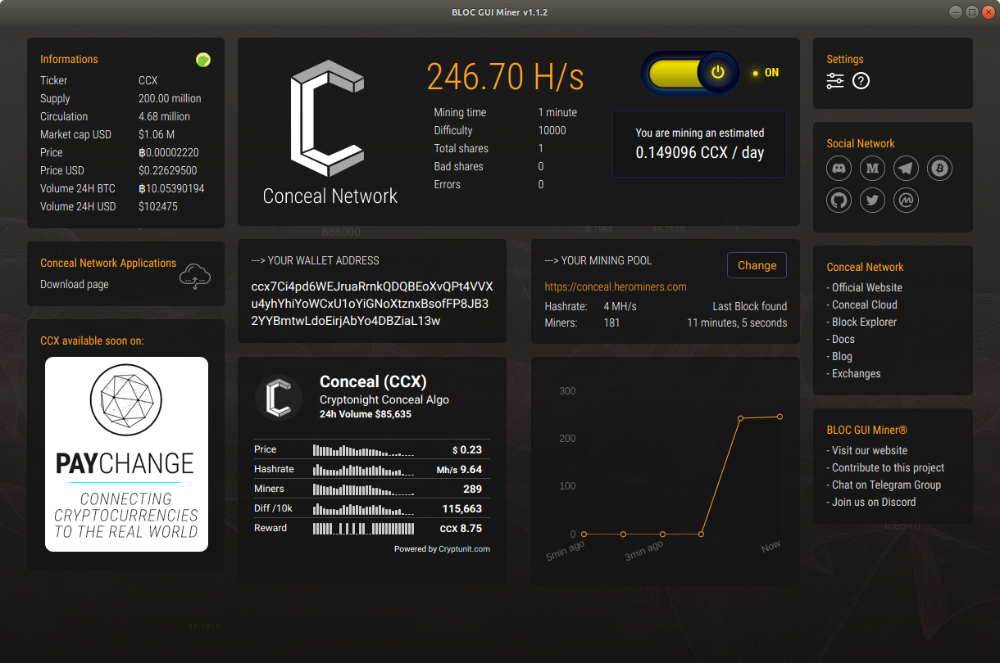](https://wiki.bloc.money/mining/bloc-gui-miner-using/#mining-conceal-ccx)

### **Quantum Resistant Ledger (QRL) Mining**

[Quantum Resistant Ledger](https://www.theqrl.org) The Quantum Resistant Ledger. Secure digital assets for longevity. Externally audited enterprise-grade blockchain platform secure against an attack from quantum computers.

*Mining QRL:*

[](https://wiki.bloc.money/mining/bloc-gui-miner-using/#mining-quantum-qrl)


## **Guide**

Make sure to check the guides how to use:

- [What is BLOC GUI Miner ?](https://wiki.bloc.money/mining/bloc-gui-miner/)
- [How to install on Windows](https://wiki.bloc.money/mining/bloc-gui-miner-using/#windows)
- [How to install on macOS](https://wiki.bloc.money/mining/bloc-gui-miner-using/#mac-os)
- [How to install on Linux](https://wiki.bloc.money/mining/bloc-gui-miner-using/#linux)
- [How to use BLOC GUI Miner to mine BLOC](https://wiki.bloc.money/mining/bloc-gui-miner-using/#start-mining)
- [How to mine TurtleCoin](https://wiki.bloc.money/mining/bloc-gui-miner-using/#mining-turtlecoin-trtl)
- [How to compile the BLOC GUI Miner](https://wiki.bloc.money/mining/BLOC-GUI-Miner-Compile)

## **Downloads Binaries**

Some antivirus packages detect cryptocurrency miners as malware and will remove the miner as soon as it's started. In order for the BLOC GUI miner to function, you'll need to exclude the miner from being scanned by your antivirus software.

- Download and install BLOC GUI Miner for [Windows, Mac and Linux](https://github.com/furiousteam/GUI-miner/releases/latest) from GitHub
- From the [Download Area](https://bloc.money/download) of BLOC.MONEY

## **Supported Miners**

BLOC GUI Miner comes with **XMR-STAK** and **XMRIG** already built-in, including configuration files for CPU and GPU mining in most of the cases.

1. [xmr-stak](https://wiki.bloc.money/mining/xmr-stak-index/) **v2.10.7**
2. [xmrig](https://wiki.bloc.money/mining/xmrig-index/) **v3.1.2**

### **XMRSTAK bundle support following coins**

- [BLOC.MONEY](https://bloc.money) **(BLOC)**
- [RYO](https://ryo-currency.com) **(RYO)**
- [Haven](https://www.havenprotocol.com) **(XHV)**
- [Monero](https://www.getmonero.org) **(XMR)**
- [Sumokoin](https://www.sumokoin.org) **(SUMO)**
- [GRAFT](https://www.graft.network) **(GRFT)**
- [Conceal Network](https://conceal.network) **(CCX)**
- [Quantum Resistant Ledger](https://www.theqrl.org) **(QRL)**

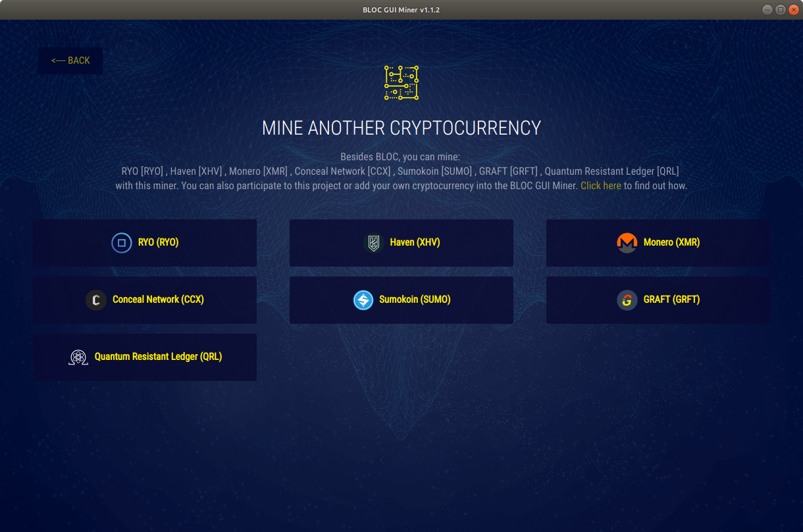

### **XMRIG bundle support following coins**

- [BLOC.MONEY](https://bloc.money) **(BLOC)**
- [TurtleCoin](https://turtlecoin.lol) **(TRTL)**
- [RYO](https://ryo-currency.com) **(RYO)**
- [Haven](https://www.havenprotocol.com) **(XHV)**
- [Monero](https://www.getmonero.org) **(XMR)**
- [Loki](https://loki.network) **(LOKI)**
- [Sumokoin](https://www.sumokoin.org) **(SUMO)**
- [GRAFT](https://www.graft.network) **(GRFT)**
- [Quantum Resistant Ledger](https://www.theqrl.org) **(QRL)**


## **Compiling on Linux (Ubuntu)**

Compiling on Linux will generate the binaries for Windows, macOS and Linux.

The miner GUI is built using [Electron](https://electronjs.org) and
[Go](https://golang.org) using the
[Astilectron app framework](https://github.com/asticode/astilectron).

### **Install dependencies**

```shell
sudo apt-get update
sudo apt-get install gcc make python libmicrohttpd10 libnss3 -y
```

- gcc and make are required for go packages  
- python is required for GUI-miner  
- libmicrohttpd is required for xmrig  
- libnss3 is required for electron  

### **Install Go**

1. [https://golang.org/dl/](https://golang.org/dl/)

2. or follow the next lines

download and unpack golang binaries

```shell
cd ~
wget https://dl.google.com/go/go1.11.2.linux-amd64.tar.gz
sudo tar -C /usr/local -xzf go1.11.2.linux-amd64.tar.gz
```

add Go to current $PATH, by editing the current user's `.bashrc`

```shell
nano ~/.bashrc 
```

add the following

```shell
# golang
export PATH=$PATH:/usr/local/go/bin
export PATH=$PATH:~/go/bin
```

run the .bashrc file (otherwise you need to logout and login again for it to get triggered)

```shell
source ~/.bashrc
```

now you could check the go installation by running

```shell
go version
```

### Clone the app

```shell
cd ~
git clone https://github.com/furiousteam/BLOC-GUI-Miner.git
```

### Install required Go packages

```shell
go get -u github.com/asticode/go-astilectron
go get -u github.com/asticode/go-astilectron-bundler/...
go get -u github.com/asticode/go-astichartjs
go get -u github.com/asticode/go-astilectron-bootstrap
go get -u github.com/google/uuid
go get -u github.com/mitchellh/go-ps
go get -u github.com/furiousteam/BLOC-GUI-Miner/src/gui
go get -u github.com/konsorten/go-windows-terminal-sequences
go get -u github.com/mattn/go-colorable
```

### Update electron version

edit `~/go/src/github.com/asticode/go-astilectron/astilectron.go` file

```shell
nano ~/go/src/github.com/asticode/go-astilectron/astilectron.go
```

and change `VersionElectron         = "1.8.1"` to `VersionElectron         = "3.0.8"`

then, recompile go-astilectron-bundler

```shell
cd ~/go/src/github.com/asticode/go-astilectron-bundler
make
```

### Compile the miner

```shell
cd ~/BLOC-GUI-Miner
make
```

If all goes well, the binaries for Windows, macOS and Linux will be available in the `bin` folder.

### Attach the miner

before you start the GUI-miner, make sure you have copied the binaries of [xmrig](https://github.com/xmrig/xmrig) or [xmr-stak](https://github.com/fireice-uk/xmr-stak) into the `miner` subfolder right next to the main GUI-miner executable

## **Make sure you have a wallet**

You need to [create your wallet](https://wiki.bloc.money/wallets/Making-a-Wallet) before start mining.

We offer different possibility for you to create a **BLOC wallet** once you start the BLOC GUI Miner and follow the installation process.

If you would like to use the BLOC GUI Miner to mine other cryptocurrency than BLOC please prepare your wallet address to use for mining.

## **I have my own miner**<a name="use-my-binaries"></a>

You are welcome to use your own [xmr-stak](https://github.com/fireice-uk/xmr-stak) or [xmrig](https://github.com/xmrig/xmrig) binaries as long as it is the same version compatible with the BLOC GUI Miner available on this page.

Use the standard procedure to compile your favorite miner and place the binaries file inside the **miner** folder next to the BLOC GUI Miner application. Once you are ready simply double click the **BLOC GUI Miner** icon to launch the application and [start mining](hhttps://wiki.bloc.money/mining/bloc-gui-miner-using/#start-mining).

For the mining stats to display correctly you need to enable the API for each miner by doing the following:

Compiling XMR-STAK with option: **-DMICROHTTPD_ENABLE=ON**

Ensure you have the following in you config.txt file

`"httpd_port" : 16000,`

Compiling XMRIG with option: by default **-DWITH_HTTPD=ON** should be enabled.

Ensure you have the following in you config.json file
```
"api":{
  "port":16000,
  "access-token":null,
  "worker-id":null
}
```

## **Mining Tuning Intensity and threads configuration**

### XMR-STAK

[xmr-stak](https://github.com/fireice-uk/xmr-stak) gives too many options for tuning to get the best results out of your hardware. By default the miner creates config file for **CPU**, **NVIDIA** and **AMD GPU**. You can edit the values within these text files and see which works best for your mining hardware. Change the value of intensity, work-size, threads and blocks. You can add more GPUs and also lower the power mode of your CPU.

XMR-Stak will save your configuration in **config.txt** in the same directory from which it was first run.

Your configuration for pools(algorithm to mine, address, port etc) will be saved in **pools.txt**
The configuration of the device it mines(CPU/AMD/NVIDIA) will be saved in **cpu.txt**, **amd.txt** or **nvidia.txt**, respectively.

For more information on Tuning and configuring your hardware in XMR-stak we suggest you to read [this guide](https://github.com/fireice-uk/xmr-stak/blob/master/doc/tuning.md)

### XMRIG

Your configuration for pools(algorithm to mine, address, port etc) will be saved in **config.json** inside the miner folder.
Use [config.xmrig.com](https://config.xmrig.com/xmrig) to generate, edit and compare configurations so you can edit your own files inside the miner folder.

## **Default Developer Donation**

### XMR-STAK

By default, the XMR-STAK will donate 2% of the hashpower (2 minutes in 100 minutes) to XMR-stak developers pool.
If you want to change that, edit [donate-level.hpp](https://github.com/fireice-uk/xmr-stak/blob/master/xmrstak/donate-level.hpp) before you build the binaries.

### XMRRIG

By default, the XMRIG will donate 5% of the hashpower (5 minutes in 100 minutes) to XMRIG developers pool.
If you want to change that, edit `config.json` before you start mining.

The BLOC GUI Miner did not change this settings as we are using the binaries from the official XMRSTAK and XMRIG GitHub rep except for macOS that was built by us and we recommend to keep the donation level as it is to support the developers of both miners.


## **Thanks**

- [Fireice](https://github.com/fireice-uk/xmr-stak) for his precious help
- [Stellite](https://github.com/stellitecoin/GUI-miner) for creating the 1st version of this GUI miner
- [TurtleCoin](https://github.com/turtlecoin/turtlecoin) for pushing the limits of Cryptonote
- [BLOC Developers](https://github.com/furiousteam/BLOC) for the great work

## **Contribute**

If you have an issue not listed here or if you would like to add a new feature to the **BLOC GUI Miner** please [submit a pull request](https://github.com/furiousteam/BLOC-GUI-Miner/compare) or log a new issue, alternatively, you can [contact us](https://wiki.bloc.money/about/community/)
________________________________________________________________


[](https://bloc.money)
