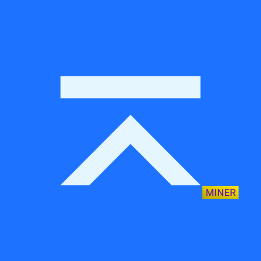

#  Bloc GUI Miner

The Bloc GUI miner is a beautiful, easy to use, interface for mining Bloc.
It is aimed at getting people that have never mined Bloc into the crypto
game by making it really simple to get started.


We currently support two very popular miner backends:

1. [bloc-stak](https://github.com/furiousteam/bloc-stak)
2. [blocrig](https://github.com/furiousteam/blocrig) (note: [xmrig-nvidia](https://github.com/xmrig/xmrig-nvidia) and [xmrig-amd](https://github.com/xmrig/xmrig-amd) does not support our v4 proof-of-work algorithm yet)

If you'd like to fork this miner for you own coin, please see the __forking__
section later.

## Compiling

### Linux

The miner GUI is built using [Electron](https://electronjs.org) and
[Go](https://golang.org) using the
[Astilectron app framework](https://github.com/asticode/astilectron).

* Install Go

[https://golang.org/dl/](https://golang.org/dl/)

* Clone and build the app

```shell
in HOME folder set sudo chmod -R 777 go/
cd go
git clone https://github.com/furiousteam/GUI-miner.git
```

* Install required Go packages

```shell
go get -u github.com/asticode/go-astilectron
go get -u github.com/asticode/go-astilectron-bundler/...
go get -u github.com/asticode/go-astichartjs
go get -u github.com/asticode/go-astilectron-bootstrap
go get -u github.com/google/uuid
go get -u github.com/mitchellh/go-ps
go get -u github.com/furiousteam/gui-miner/src/gui
go get -u github.com/konsorten/go-windows-terminal-sequences
go get -u github.com/mattn/go-colorable
```

* Update electron version from 1.8.1 to 3.0.8:

edit `~/go/src/github.com/asticode/go-astilectron/astilectron.go` file

```shell
nano ~/go/src/github.com/asticode/go-astilectron/astilectron.go
```

and change `VersionElectron         = "1.8.1"` to `VersionElectron         = "3.0.8"`

then, recompile go-astilectron-bundler

```shell
cd ~/go/src/github.com/asticode/go-astilectron-bundler
make
```

* COMPILE GUI MINER:

```shell
source ~/.profile (make sure correct GOPATH is set)
cd go/
cd GUI-miner
make
```

NOTE: Ensure you clone the GUI miner into your working $GOPATH

If all goes well the binaries for Windows, macOS and Linux will be available in the `bin` folder.