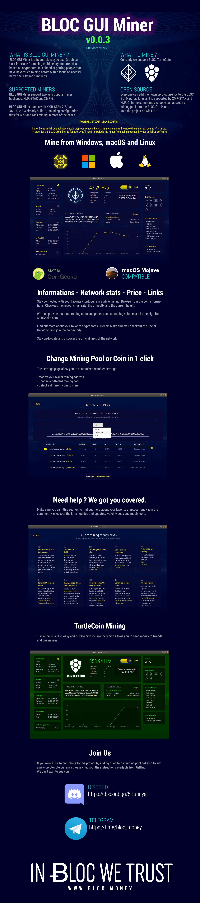

# **BLOC GUI Miner**

[BLOC GUI Miner](https://github.com/furiousteam/BLOC-GUI-Miner) is a beautiful, easy to use, Graphical User interface for mining multiple cryptocurrencies based on cryptonote.

It is aimed at getting people that have never tried mining before with a focus on accessibility, security and simplicity.


BLOC GUI Miner support two very popular miner backends: [xmr-stak](https://github.com/fireice-uk/xmr-stak) and [xmrig](https://github.com/xmrig/xmrig)

BLOC GUI Miner comes with **XMR-STAK 2.7.1** and XMRIG **2.8.3** already built-in, including configuration files for CPU and GPU mining in most of the cases.


## **Supported Cryptocurrency**

Everyone can add their own cryptocurrency to the BLOC GUI Miner as long as it is supported by **XMR-STAK** and **XMRIG**.
In the same time everyone can add/edit a mining pool into the BLOC GUI Miner.

Curently we support :

- [BLOC.MONEY](https://bloc.money) **(BLOC)**
- [TurtleCoin](https://turtlecoin.lol) **(TRTL)**
- [RYO](https://ryo-currency.com) **(RYO)**

If you would like to contribute to this project by adding or editing a mining pool but also to add a new cryptonote currency please checkout the [instructions available](https://github.com/furiousteam/BLOC-GUI-Miner/tree/master/coins).

## **BLOC Mining**

[BLOC.MONEY](https://bloc.money) is a fast, easy to use and private decentralized cryptocurrency. Send money spacewide, worldwide or locally, immediately and without costly intermediaries using the blockchain technology.

*Overview:*

[](https://wiki.bloc.money/mining/bloc-gui-miner-using/)

*Help:*

[](https://wiki.bloc.money/mining/bloc-gui-miner-using/)

## **TurtleCoin Mining**

[TurtleCoin](https://github.com/turtlecoin/turtlecoin) is a fast, easy and private cryptocurrency which allows you to send money to friends and businesses.

*Overview:*

[](https://wiki.bloc.money/mining/bloc-gui-miner-using/#mining-turtlecoin-trtl)

*Mining Pools:*

[](https://wiki.bloc.money/mining/bloc-gui-miner-using/#mining-turtlecoin-trtl)

## **Supported Miners**

BLOC GUI Miner comes with **XMR-STAK** and **XMRIG** already built-in, including configuration files for CPU and GPU mining in most of the cases.

1. [xmr-stak](../mining/XMR-Stak-index.md) **v2.7.1**
2. [xmrig](../mining/XMRIG-index.md) **v2.8.3** (note: [xmrig-nvidia](https://github.com/xmrig/xmrig-nvidia) and [xmrig-amd](https://github.com/xmrig/xmrig-amd) are not yet implented

## **Guide**

Make sure to check the guides how to use:

- [What is BLOC GUI Miner ?](https://wiki.bloc.money/mining/bloc-gui-miner/)
- [How to install on Windows](https://wiki.bloc.money/mining/bloc-gui-miner-using/#windows)
- [How to install on macOS](https://wiki.bloc.money/mining/bloc-gui-miner-using/#mac-os)
- [How to install on Linux](https://wiki.bloc.money/mining/bloc-gui-miner-using/#linux)
- [How to use BLOC GUI Miner to mine BLOC](https://wiki.bloc.money/mining/bloc-gui-miner-using/#start-mining)
- [How to mine TurtleCoin](https://wiki.bloc.money/mining/bloc-gui-miner-using/#mining-turtlecoin-trtl)

## **Downloads Binaries**

Some antivirus packages detect cryptocurrency miners as malware and will remove the miner as soon as it's started. In order for the BLOC GUI miner to function, you'll need to exclude the miner from being scanned by your antivirus software.

- Download and install BLOC GUI Miner for [Windows, Mac and Linux](https://github.com/furiousteam/GUI-miner/releases/latest) from GitHub
- From the [Download Area](https://bloc.money/download) of BLOC.MONEY

## **Compiling on Linux (Ubuntu)**

Compiling on Linux will generate the binaries for Windows, macOS and Linux.

The miner GUI is built using [Electron](https://electronjs.org) and
[Go](https://golang.org) using the
[Astilectron app framework](https://github.com/asticode/astilectron).

### **Install dependencies**

```shell
sudo apt-get update
sudo apt-get install gcc make python libmicrohttpd10 libnss3 -y
```

- gcc and make are required for go packages  
- python is required for GUI-miner  
- libmicrohttpd is required for xmrig  
- libnss3 is required for electron  

### **Install Go**

1. [https://golang.org/dl/](https://golang.org/dl/)

2. or follow the next lines

download and unpack golang binaries

```shell
cd ~
wget https://dl.google.com/go/go1.11.2.linux-amd64.tar.gz
sudo tar -C /usr/local -xzf go1.11.2.linux-amd64.tar.gz
```

add Go to current $PATH, by editing the current user's `.bashrc`

```shell
nano ~/.bashrc 
```

add the following

```shell
# golang
export PATH=$PATH:/usr/local/go/bin
export PATH=$PATH:~/go/bin
```

run the .bashrc file (otherwise you need to logout and login again for it to get triggered)

```shell
source ~/.bashrc
```

now you could check the go installation by running

```shell
go version
```

### Clone the app

```shell
cd ~
git clone https://github.com/furiousteam/BLOC-GUI-Miner.git
```

### Install required Go packages

```shell
go get -u github.com/asticode/go-astilectron
go get -u github.com/asticode/go-astilectron-bundler/...
go get -u github.com/asticode/go-astichartjs
go get -u github.com/asticode/go-astilectron-bootstrap
go get -u github.com/google/uuid
go get -u github.com/mitchellh/go-ps
go get -u github.com/furiousteam/BLOC-GUI-Miner/src/gui
go get -u github.com/konsorten/go-windows-terminal-sequences
go get -u github.com/mattn/go-colorable
```

### Update electron version

edit `~/go/src/github.com/asticode/go-astilectron/astilectron.go` file

```shell
nano ~/go/src/github.com/asticode/go-astilectron/astilectron.go
```

and change `VersionElectron         = "1.8.1"` to `VersionElectron         = "3.0.8"`

then, recompile go-astilectron-bundler

```shell
cd ~/go/src/github.com/asticode/go-astilectron-bundler
make
```

### Compile the miner

```shell
cd ~/BLOC-GUI-Miner
make
```

If all goes well, the binaries for Windows, macOS and Linux will be available in the `bin` folder.

### Attach the miner

before you start the GUI-miner, make sure you have copied the binaries of [xmrig](https://github.com/xmrig/xmrig) or [xmr-stak](https://github.com/fireice-uk/xmr-stak) into the `miner` subfolder right next to the main GUI-miner executable

## **Thanks**

- [Fireice](https://github.com/fireice-uk/xmr-stak) for his precious help
- [Stellite](https://github.com/stellitecoin/GUI-miner) for creating the 1st version of this GUI miner
- [TurtleCoin](https://github.com/turtlecoin/turtlecoin) for pushing the limits of Cryptonote
- [BLOC Developers](https://github.com/furiousteam/BLOC) for the great work

## **Contribute**

If you have an issue not listed here or if you would like to add a new feature to the **BLOC GUI Miner** please [submit a pull request](https://github.com/furiousteam/BLOC-GUI-Miner/compare) or log a new issue, alternatively, you can [contact us](https://wiki.bloc.money/about/community/)
________________________________________________________________


[](https://bloc.money)